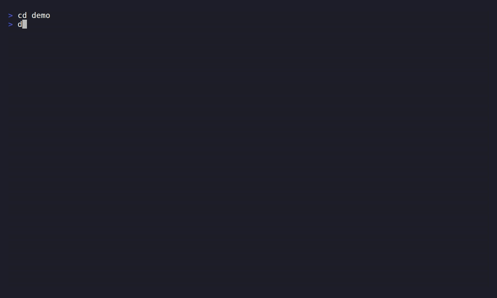

# Draugr

> Developer-first, descriptor-driven security scanning orchestration.

[](https://github.com/draugr-dev/draugr/actions/workflows/ci.yml)
[](https://scorecard.dev/viewer/?uri=github.com/draugr-dev/draugr)
[](https://www.bestpractices.dev/projects/13631)
[](https://github.com/draugr-dev/draugr/releases)
[](LICENSE)

**Describe your app. Draugr figures out the rest.**

You declare what you *know* about your software — where the repos are, what container
images it builds, what endpoints it exposes, what infrastructure it runs on — in a single
descriptor (`draugr.saga.yaml`). Draugr infers which security controls apply, runs the
right scanner for each, and produces pass/fail evidence you can trust. Swap scanners
freely — use the tools you already pay for, or Draugr's open-source defaults. Every result
is normalized to **SARIF**.

This is the open-source core engine.

## See it in action



`draugr scan .` on the demo sandbox — no descriptor, just a prioritized verdict:

```text
Draugr — FAIL   (draugr-demo 0.0.0)

Priorities:  P1 21   P2 25   P3 13   P4 0

Controls:
  sca      FAIL  8 error   9 warning   1 note
  secrets  FAIL  1 error   0 warning   0 note
  iac      FAIL  4 error   5 warning  12 note
  sast     FAIL  7 error  12 warning   0 note

Fix first:
  P1  error    9.8  CVE-2019-20477    sca  app/requirements.txt:4
  P1  error    9.8  CVE-2020-14343    sca  app/requirements.txt:4
  P1  error    8.0  KSV-0014          iac  deploy/pod.yaml:8
  P1  error    8.0  KSV-0118          iac  deploy/pod.yaml:6
  P1  error    7.5  CVE-2018-1000656  sca  app/requirements.txt:2
  …

… and 49 more finding(s). Use --format json for the full report, or -o <dir> for report.json + results.sarif.
```

**[draugr-dev/draugr-demo](https://github.com/draugr-dev/draugr-demo)** is an intentionally
vulnerable sample app wired to Draugr. Every control lights up, the findings are prioritized
P1–P4, and results land in the repo's **Security → Code scanning** tab — a safe sandbox to see
exactly what Draugr delivers before pointing it at your own code. The example PRs there also show
the **new-vs-fixed PR diff** and the sticky comment.

## Status

🚧 **Early, and moving fast.** Working today:

- **Controls:** `images` (Trivy), `sca` (Trivy fs), `secrets` (Gitleaks), `sast` (Semgrep,
  plus opt-in gosec for Go), `iac` (Trivy config), `headers` (native HTTP-header analyzer).
  See the [integrations catalog](docs/reference/catalog.md).
- **Pipeline:** end-to-end `scan` (plan → scan → judge → report), content-hash caching,
  tunable parallelism (`-j`), results normalized to SARIF.
- **Prioritization:** declare a component's `exposure` and `criticality` and Draugr ranks
  every finding P1–P4 (`--min-priority` to focus, `--fail-on-priority` to gate);
  optional KEV/EPSS enrichment for real-world exploitability.
- **Discovery ("the Ravens"):** `survey` for Kubernetes images and GitHub org repositories.
- **Zero-config & scaffolding:** `scan .` scans the current repo with no descriptor
  (sca/secrets/sast/iac); `init` scaffolds a stack-detected `draugr.saga.yaml` to customize.
- **Preflight & tooling:** `validate` (schema-check a Saga), `doctor` (which scanner tools are
  present/missing), `tools install` (fetch pinned, checksum- and cosign-verified scanners —
  and cosign itself — into `~/.draugr/bin`), and `self-update` (update draugr itself, verified).

More controls (DAST, TLS, SBOM, …) are on the roadmap. See
[controls & scanners](docs/concepts/controls-and-scanners.md) for what maps to what.

## Quickstart

**Requirements:** the external scanners for the controls you use —
[Trivy](https://github.com/aquasecurity/trivy) (`images`, `sca`, `iac`),
[Gitleaks](https://github.com/gitleaks/gitleaks) (`secrets`),
[Semgrep](https://semgrep.dev) (`sast`); `git` for repo scans. Or run
`draugr tools install` to fetch pinned, verified copies. Go 1.26+ only to build from source.

**Install from a release (recommended):**

```bash
gh release download --repo draugr-dev/draugr \
  -p "draugr_*_$(uname -s | tr A-Z a-z)_amd64.tar.gz"   # omit a tag = latest
tar -xzf draugr_*_amd64.tar.gz draugr
sudo mv draugr /usr/local/bin/ && draugr version
```

Releases are cosign-signed with SBOMs and SLSA build provenance — see
[install & verifying downloads](docs/getting-started/install.md) for the verifying `curl` recipe.
Once installed, update in place with **`draugr self-update`**.

**Or build from source:**

```bash
git clone https://github.com/draugr-dev/draugr.git
cd draugr && make build      # produces ./bin/draugr
./bin/draugr version
```

**Fastest path — zero config.** Point Draugr at a repo and go; no descriptor needed:

```bash
draugr scan .        # scans the current repo: sca, secrets, sast, iac
draugr init          # or scaffold a draugr.saga.yaml (stack-detected) to customize
```

For full control, write a `draugr.saga.yaml` (see [`examples/`](examples/draugr.saga.yaml)):

```yaml
release:
  name: my-app
  version: "1.0"
config:
  controllers:
    images:
      enabled: true
components:
  - name: web
    images:
      - image: alpine:3.19
```

Scan it:

```bash
draugr scan draugr.saga.yaml            # console summary; exits non-zero on fail
draugr scan draugr.saga.yaml -o out/    # also writes out/report.json + out/results.sarif
draugr scan draugr.saga.yaml --fail-on warning
draugr scan draugr.saga.yaml --format markdown   # or html, junit, json, sarif
```

Compare two scans to see what a change introduced (and gate a PR on *new* findings only):

```bash
draugr diff base/results.sarif head/results.sarif                     # new / fixed / unchanged
draugr diff base/results.sarif head/results.sarif --fail-on-new-priority P1
```

Let discovery write the descriptor for you (the Ravens):

```bash
draugr survey --github-org my-org -o draugr.saga.yaml
draugr survey --k8s-images --k8s-namespace prod --merge -o draugr.saga.yaml
```

Full walkthrough: [`docs/getting-started/quickstart.md`](docs/getting-started/quickstart.md).

## Use in CI (GitHub Actions)

Add Draugr to a repository's CI and code scanning with the first-party action. It downloads a
cosign-verified Draugr release, runs the scan, and hands the merged SARIF to GitHub code
scanning — one clean **Draugr** tool in the Security tab:

```yaml
permissions:
  contents: read
  security-events: write   # upload SARIF to code scanning

steps:
  - uses: actions/checkout@v4
  - id: draugr
    uses: draugr-dev/draugr@v0.25.0     # pin a release; installs Draugr for you
    with:
      saga: draugr.saga.yaml
      tools: true                       # provision the scanners the controls need
      fail-on: warning                  # optional gate (default: error)
  - if: always()                        # publish findings even when the gate fails
    uses: github/codeql-action/upload-sarif@v3
    with:
      sarif_file: ${{ steps.draugr.outputs.sarif }}
```

With `tools: true` the action provisions the scanners each control needs (Trivy, Gitleaks,
Semgrep). See the [GitHub Action guide](docs/guides/github-action.md) for the full workflow and
all inputs.

## Documentation

**[Full documentation index →](docs/README.md)** (grouped by task, with a "building blocks"
glossary of Saga / Norn / Skald / the Ravens).

- [Quickstart](docs/getting-started/quickstart.md) — install, first scan, first survey, CI usage
- [Concepts](docs/concepts/saga.md) — Saga, controllers, scanners, surveyors, the pipeline, verdicts
- [Pipeline stages](docs/contributing/pipeline.md) — each stage in depth, incl. how the Norn (gate) works
- [Glossary](docs/reference/glossary.md) — security categories explained (SCA, SAST, DAST, SBOM, …)
- [Integrations catalog](docs/reference/catalog.md) — every controller/scanner/surveyor, with per-component docs + licenses
- [Changelog](CHANGELOG.md) — user-facing release notes
- [CLI reference](docs/reference/cli.md) — every command and flag
- [Saga schema](docs/reference/saga-schema.md) — the descriptor, field by field
- [Architecture](docs/contributing/architecture.md) · [Plugin API](docs/contributing/plugin-api.md) · [Naming](docs/contributing/naming.md)

## Security & supply chain

A security tool should hold itself to what it checks. Draugr does:

- **Standard output** — every finding is normalized to **SARIF 2.1.0** (OASIS), so results flow
  into GitHub / GitLab / Azure DevOps code scanning and any SARIF-aware tool.
- **Signed releases + provenance** — release archives' `checksums.txt` is **keyless-signed with
  cosign** (Sigstore) into a `checksums.txt.sigstore.json` bundle, and each release publishes
  **SLSA build-provenance** attestations (`gh attestation verify …`); verify before installing
  ([recipe](docs/trust-and-operations/verifying-releases.md)).
- **SBOMs** — a Syft **SBOM** is published for every release archive.
- **Verified tooling** — `draugr tools install` fetches scanners pinned by **SHA-256** and, where
  the upstream signs them, verifies the **cosign** signature too — and cosign itself is
  installable, so verification is self-sufficient.
- **We scan ourselves** — Draugr runs on its own repo every PR (dogfood self-scan), and we track
  our supply-chain posture with the **[OpenSSF Scorecard](https://scorecard.dev/viewer/?uri=github.com/draugr-dev/draugr)**
  (badge above).
- **Report a vulnerability** — see [SECURITY.md](SECURITY.md).

## Development

Requires Go 1.26+.

```bash
make build   # build ./bin/draugr
make gate    # full local gate: fmt, vet, golangci-lint, race tests + coverage, govulncheck
make test    # run tests
```

### Observability

Draugr uses [Cobra](https://github.com/spf13/cobra) for the CLI, `log/slog` for structured
logging (`--log-level`, `--log-format json|text`), and [OpenTelemetry](https://opentelemetry.io)
for traces and metrics. Telemetry is opt-in via the standard `OTEL_*` environment variables
(e.g. `OTEL_EXPORTER_OTLP_ENDPOINT`) — a no-op with zero overhead when unset. Logs and spans
never carry secrets.

## License

Draugr is licensed under the [Apache License 2.0](LICENSE).
